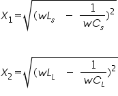

### Procedure
<h2> Circuit Diagram </h2>
							 
							&nbsp;
                            

                                

							
[Fig 1: Circuit diagram of experimental set-up for verification of maximum power transfer theorem]
 
							 							
							&nbsp;
							
<b>1. When only XL is adjustable: </b> 

							 
							&nbsp;
							<ol>
								<li>Take a suitable set of values of Vs, XS, &nbsp;XL as shown in the figure. You can choose XS to be inductive (Ls) and capacitive (Cs). XL can choose as inductive(LL) and capacitive (CL) to the load.</li>
								<li>Next choose a suitable load resistance (RL).</li>
								<li>For the maximum power theorem, the condition would be RL=RS, &nbsp;XS(i.e. X1)=-XL.(i.e. X2)</li>
								
Where, 

								

									
								 
								&nbsp;
								

							
								
Take an example, put Ls=1mH, Cs=10.1&micro;F.

								
&nbsp;

								
Now for different value of Cs, note down V1 and V4.

								
&nbsp;

								
Load power (PL) = I2*RL&nbsp; = I*I*RL = (V1/100)*V4
								 = K*V1*V4&nbsp;
								 &nbsp;where K=1/100 = 1/Rs&nbsp; 

								

								
&nbsp;

								
Enter the value of the voltage for different values of Cs and obtain the set corresponding to the maximum value of (V1*V4). Verify that for
								this set &nbsp; &nbsp;V2=V6.&nbsp;

							</ol>
							 
							&nbsp;
							
<b>2. When only RL is adjustable: </b>

							 
							&nbsp;
							
Repeat the procedure of part (1), with Cs fixed and RL varied. At the point of maximum power check
							$$R_L=\sqrt(R_s^2 + (X_1 + X_2)^2)$$ and VRL=V4.

							 
							&nbsp;
							
<b>3. When both RL and XL are adjustable:</b> 

							 
							&nbsp;
							
Repeat the procedure of part (2), varying Cs and obtain the maximum power condition.

							
&nbsp;

							
Check under this condition,

							
&nbsp;

							
 VRL= VRS &nbsp;i.e. V1=V4&nbsp;;

							
&nbsp;

							
 VLS= VCL&nbsp; &nbsp;i.e. V2=V6&nbsp;;

							
&nbsp;
